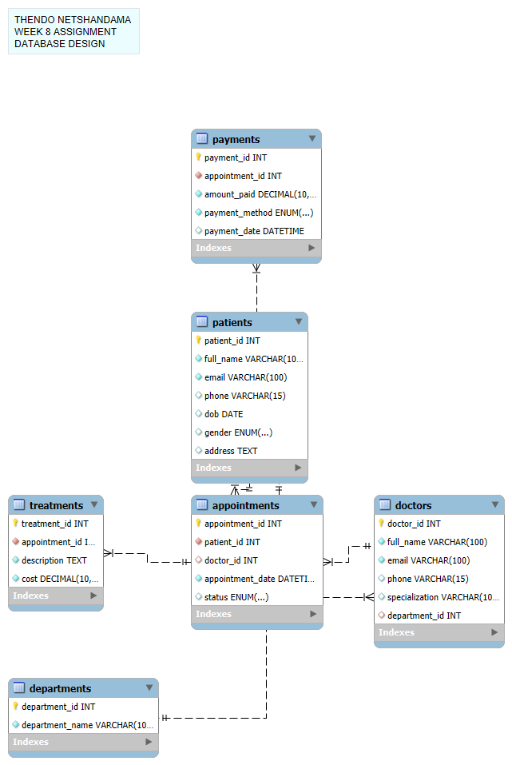

# Clinic-database-mysql-W8# 📋 ClinicDB: A Relational Database System for Patient & Appointment Management

## 🏥 Project Description

ClinicDB is a structured relational database system designed to manage day-to-day operations of a healthcare clinic. This MySQL-powered system allows efficient storage and retrieval of data related to patients, doctors, appointments, treatments, payments, and departments. The schema supports complex relationships and ensures data integrity through proper constraints such as primary keys, foreign keys, cascading deletes, and uniqueness.

The goal is to simulate a real-world clinical data management scenario using core SQL principles while keeping the project scalable, normalized, and relationally accurate.

---

## 🚀 How to Run/Set Up the Project

### Prerequisites:

* MySQL Server (or XAMPP, WAMP, etc.) installed
* MySQL Workbench or any other SQL client (optional but helpful)

### Steps to Import the Database:

1. Clone this repository:

   ```bash
   git clone https://github.com/your-username/clinic-database-mysql.git
   ```
2. Open MySQL Workbench (or your preferred SQL tool).
3. Open the `clinic_db_schema.sql` file.
4. Run the entire script to create all tables and relationships.
5. Verify that the tables were created and constraints applied.

✅ That’s it — your ClinicDB is ready for data!

---

## 🗃️ ERD (Entity Relationship Diagram)

> You can view or download the ERD from this link:

📎 

---

## 📂 Repository Structure

```
clinic-database-mysql/
├── clinic_db_schema.sql        # ✅ Well-commented SQL schema (single file)
├── README.md                   # 📌 This documentation file
└── erd.png                     # 📷 export of ERD diagram 
```

---

## ✅ Deliverables Checklist

* [x] Real-world use case: Clinic Booking & Patient Management System
* [x] Relational database design using SQL
* [x] One-to-One, One-to-Many relationships
* [x] Primary Key, Foreign Key, NOT NULL, UNIQUE constraints
* [x] ON DELETE CASCADE where applicable
* [x] One `.sql` file (well-commented)
* [x] ERD included
* [x] Full setup instructions

---

💡 Built with ❤️ by Thendo Netshandama
